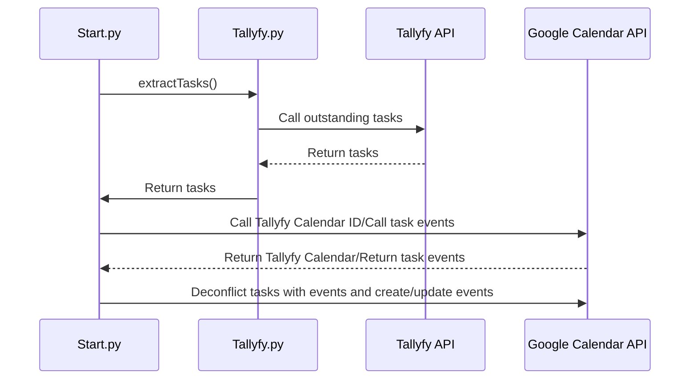

# Tallyfy-Google Calendar Sync Tool

This tool enables you to sync outstanding tasks on your Tallyfy account to your Google Calendar at your command. It uses the [Tallyfy API](https://go.tallyfy.com/api/) and [Google Calendar API](https://developers.google.com/calendar/) to create or update tasks on the calendar.

## Design and Features
The **Tallyfy-Google Calendar Sync Tool** was designed in mind to leverage Tallyfy's process builder for complicated, multi-partner projects while enabling your team to quickly sync the deadlines for tasks. Only tasks allocated the team member would be synced on his/her respective Google Calendar.
 - Create a dedicated Google Calendar for all tasks synced from Tallyfy
 - Create and update Calendar events that were originally set as tasks on Tallyfy
 - Support html formatting for the Google Calendar event description
 - Do note that Tallyfy is a task-based data model that does not specify a start and end time
	 - As a  result, the deadline for the task has been assigned as an all-day Calendar event

## Installation

### Pre-requisites:

 - Google account
 - Python is required, version 3+ is preferred. [Download and install Python from here](https://www.python.org/downloads/).
 - [pip](https://pypi.python.org/pypi/pip) package management tool required to install Google Client Library

 ### Installation Instructions:

1. From Tallyfy dashboard, under *Settings >> Integrations*, copy your *Organization ID*.
 2. Open Tallyfy.py and insert your Tallyfy email, Tallyfy password, and organization ID into lines 7-9

> authDict["password"] = "YOUR TALLYFY PASSWORD"
authDict["email"] = "YOUR TALLYFY EMAIL"
orgID = "YOUR ORGANIZATION ID"

 3. Follow step 1 and 2 of the [Python Quickstart Setup for Google API](https://developers.google.com/calendar/quickstart/python) and copy the client_secret.json file into the same folder for the **Tallyfy-Google Calendar Sync Tool**
 4. You should be ready to run Start.py on the console by moving to the active folder and execute the command `>> python Start.py`
 5. Whenever you update your Tallyfy tasks, you would need to run Start.py again.

## Troubleshooting and Limitations

The **Tallyfy-Google Calendar Sync Tool** was designed with efficiency in mind. It would only be able to synchronize up to 250 events/tasks on the Tallyfy Google calendar from a month before the time of executing the script to the future.

 - Tasks created with deadlines on the Google Calender back more than a month ago would be ignored as it assumes you would have completed them by then.
 - If your Tallyfy has more than 250 tasks outstanding in your dashboard (which is highly unlikely), you would need to adjust the code from your use.

## Sequence diagram

The following demonstrates the API calls that occur:

## License

### MIT License

Copyright (c) 2018 Joshua Cheong

Permission is hereby granted, free of charge, to any person obtaining a copy of this software and associated documentation files (the "Software"), to deal in the Software without restriction, including without limitation the rights to use, copy, modify, merge, publish, distribute, sublicense, and/or sell copies of the Software, and to permit persons to whom the Software is furnished to do so, subject to the following conditions:

The above copyright notice and this permission notice shall be included in all copies or substantial portions of the Software.

THE SOFTWARE IS PROVIDED "AS IS", WITHOUT WARRANTY OF ANY KIND, EXPRESS OR IMPLIED, INCLUDING BUT NOT LIMITED TO THE WARRANTIES OF MERCHANTABILITY, FITNESS FOR A PARTICULAR PURPOSE AND NONINFRINGEMENT. IN NO EVENT SHALL THE AUTHORS OR COPYRIGHT HOLDERS BE LIABLE FOR ANY CLAIM, DAMAGES OR OTHER LIABILITY, WHETHER IN AN ACTION OF CONTRACT, TORT OR OTHERWISE, ARISING FROM, OUT OF OR IN CONNECTION WITH THE SOFTWARE OR THE USE OR OTHER DEALINGS IN THE SOFTWARE.
